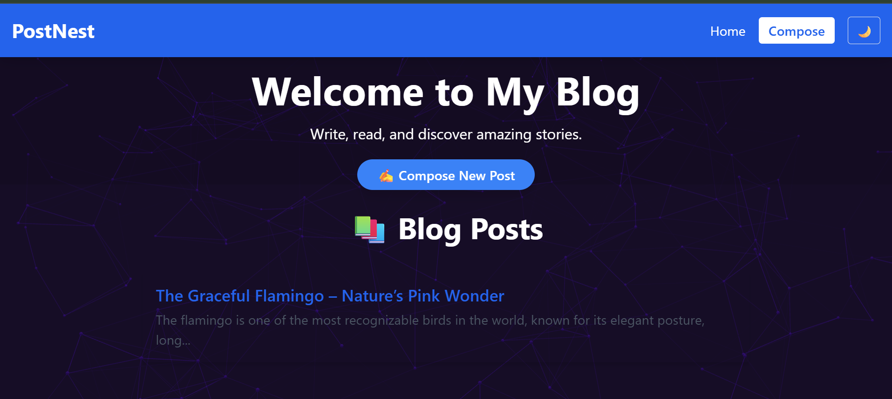
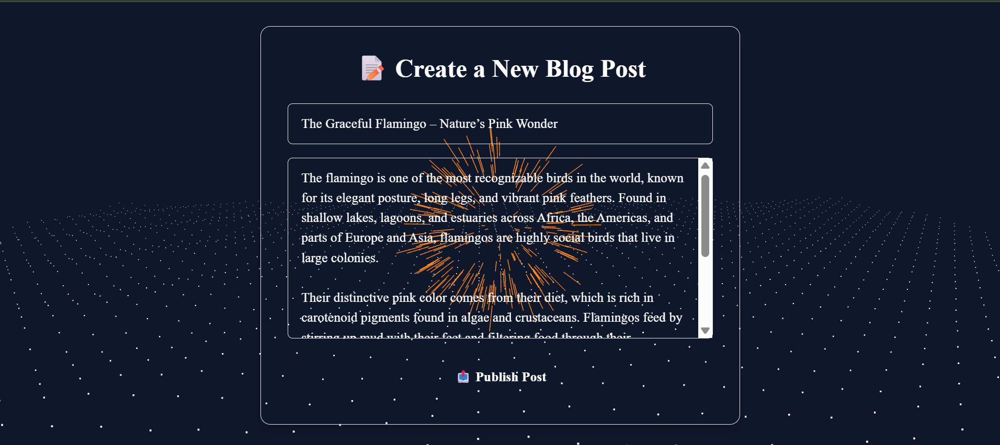
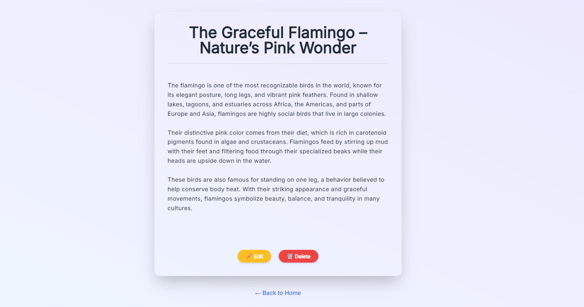

# 📝 Blog App

A simple and dynamic blog web application built using **Node.js**, **Express.js**, and **EJS**. Users can compose, view, and edit blog posts. Data is rendered server-side using EJS templates.

---

## 📁 Project Structur
```
blog-app/
├── node_modules/ 
├── public/ 
├── views/  
│ ├── partials/  
│ ├── compose.ejs  
│ ├── edit.ejs  
│ ├── home.ejs 
│ └── post.ejs 
├── .gitignore  
├── app.js 
├── package.json  
└── package-lock.json  

```
---

## 🚀 Features

- Create and publish blog posts
- View all blog posts on the home page
- View individual blog posts
- Edit existing blog posts
- Server-side rendering using EJS

---

## 🛠️ Tech Stack

- **Node.js** – JavaScript runtime
- **Express.js** – Web framework
- **EJS** – Templating engine
- **HTML/CSS** – Front-end structure and styling

---

## 🖼️ Screenshot

Below is a screenshot of the project structure:






 

---

## ⚙️ Installation

```bash
# Clone the repo
git clone https://github.com/maniishh/blog-app.git

# Move into the directory
cd blog-app

# Install dependencies
npm install

# Run the application
node app.js
